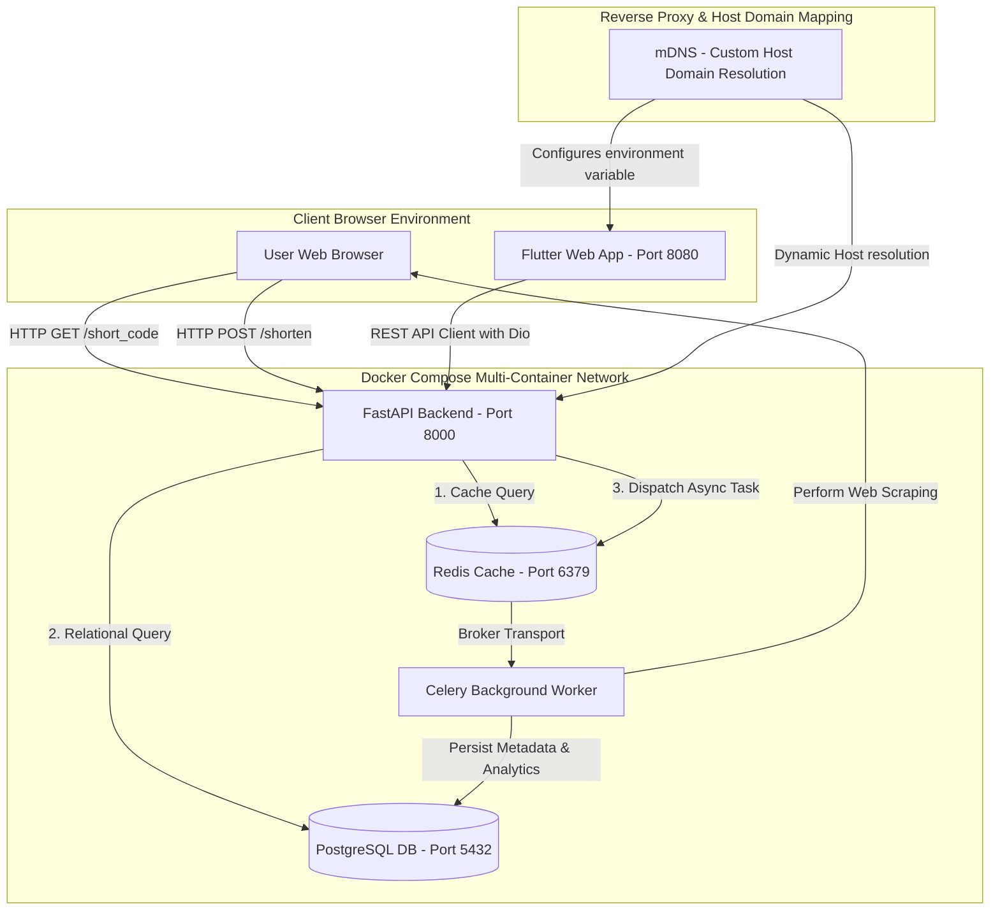
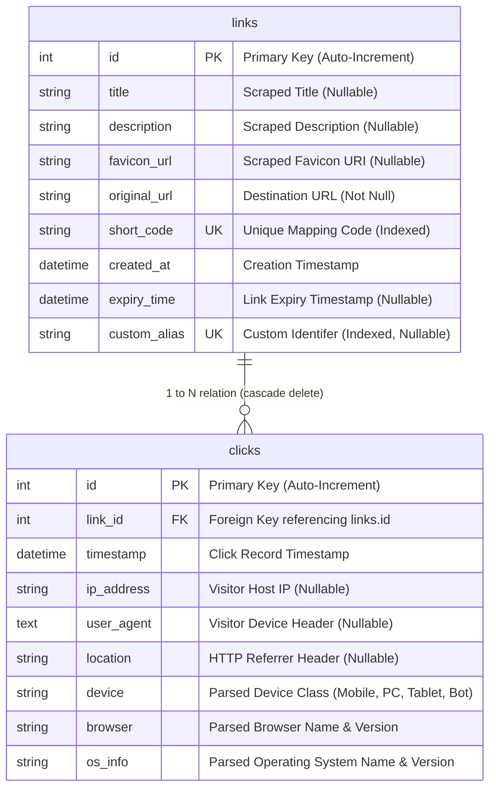
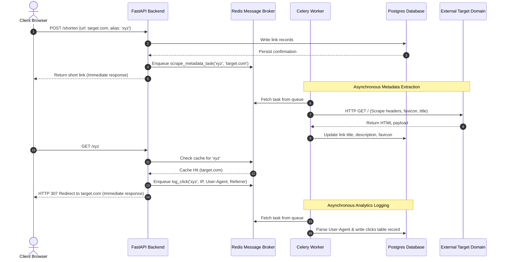
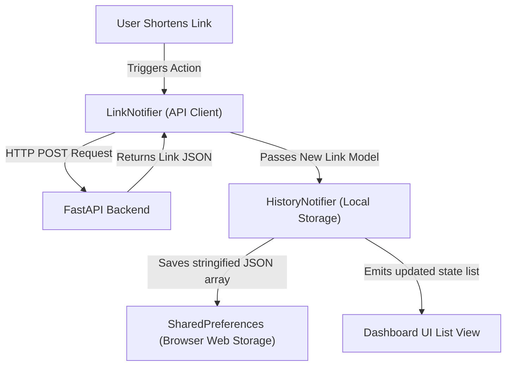

# Enterprise URL Shortener & Analytics Platform
## Architecture, System Design, and Integration Specification

This document provides a production-grade, in-depth technical analysis and operational manual for the containerized URL Shortener and Analytics system. Designed for enterprise-level latency compliance, data integrity, and high-fidelity aesthetics, the platform consists of an asynchronous FastAPI backend, a responsive Flutter Web front-end utilizing a sophisticated Midnight Gold theme, Redis for caching, PostgreSQL for persistent storage, and Celery for background job worker offloading.

---

## 1. System Architecture & Topology

The platform is architected as an orchestrated suite of decoupled microservices. The infrastructure relies on Docker network isolation and host-to-container port mappings to isolate compute and storage layers.

### 1.1 Unified System Integration Blueprint

The following diagram demonstrates the data flow, network boundaries, and asynchronous execution pathways across the system components:



---

## 2. Backend Architecture Deep Dive

The backend service is built using **Python 3.12** and **FastAPI**, structured to maintain a clear boundary between routing, database management, schema validation, and asynchronous processing. 

### 2.1 File-by-File Codebase Analysis

The backend contains the following core components:
1.  **`main.py` (Application Lifecycle & Middleware)**: Initializes the FastAPI application, reads environment variables (such as `ALLOWED_ORIGINS` for CORS configuration), mounts the routing schemas, and conditionally generates database schemas using SQLAlchemy ORM metadata on startup.
2.  **`api.py` (Request Routing & Response Handling)**: Defines endpoints for link creation, redirection, QR generation, and statistics gathering. It coordinates caching policies and offloads heavy background operations to Celery.
3.  **`models.py` (Relational Entities)**: Holds the declarative models (`Link` and `Click`) matching the relational tables mapped via SQLAlchemy.
4.  **`schemas.py` (Pydantic Schema Serialization)**: Defines the data validation structures for input requests (`LinkCreate`) and output responses (`LinkResponse`, `LinkStats`).
5.  **`database.py` (ORM Session Pooling)**: Builds the SQLAlchemy connection engine, session maker, and standard dependency (`get_db`) to inject sessions into route handlers.
6.  **`redis_client.py` (Memory Storage Integration)**: Instantiates the connection pool to the Redis container using standard connection parameters, configuring automatic string decoding.
7.  **`tasks.py` (Celery Tasks Definition)**: Implements asynchronous handlers executed by the worker service, utilizing the common PostgreSQL connection configuration.
8.  **`utils.py` (Shared Helper Utilities)**: Contains cryptographic short-code generation, domain naming sanitization, custom alias formatting rules, and BeautifulSoup-based web-scraping logic.

---

### 2.2 Relational Database Schema (ERD)

The persistence layer uses a PostgreSQL relational database. The design focuses on indexes optimized for fast lookups on unique short codes.



- **Indices & Optimization**: Columns `short_code` and `custom_alias` are uniquely indexed. The ORM maps a cascade relationship on `clicks` so that deleting a link automatically removes its corresponding analytics logs, preventing data leakage or constraint conflicts.

---

### 2.3 Caching Layer & Redirection Engine

To minimize response times during client redirections, a high-performance Redis cache sits in front of the database.

- **Cache Keys**:
  - Direct Redirect Mapping: `[short_code] -> [original_url]`
  - Aggregated Statistics Cache: `stats:[short_code] -> [json_serialized_stats_schema]`
- **TTL Strategy**: 
  - Dynamic links without expiration values are cached indefinitely in Redis.
  - Links configured with an expiration timestamp are cached with a dynamic Time-To-Live (TTL) matching the exact remaining lifespan (`expiry_time - current_time`).
  - Statistics data is cached with a short-lived **60-second TTL** to balance database load against data recency.
- **Failover Logic**: If the Redis client experiences a network timeout or connection refusal, the application catches the error, logs a warning, and falls back to performing standard database queries, ensuring the API remains operational.

---

### 2.4 Asynchronous Worker Pipeline (Celery)

Rather than running expensive HTTP scrapers or parsing client analytics on the web request thread, FastAPI delegates these tasks to Celery via a Redis broker.



---

### 2.5 REST API Endpoint Reference

#### Create Short Link
- **Endpoint**: `POST /shorten`
- **Content-Type**: `application/json`
- **Request Body**:
  ```json
  {
    "original_url": "https://example.com/very/long/destination/url",
    "custom_alias": "my_alias",
    "expiry_time": "2026-12-31T23:59:59Z"
  }
  ```
- **Responses**:
  - `200 OK`: Link created successfully.
    ```json
    {
      "id": 12,
      "title": null,
      "description": null,
      "favicon_url": null,
      "original_url": "https://example.com/very/long/destination/url",
      "short_code": "my_alias",
      "short_url": "http://192.168.1.100:8000/my_alias",
      "created_at": "2026-06-09T14:15:00Z",
      "expiry_time": "2026-12-31T23:59:59Z",
      "custom_alias": "my_alias",
      "qr_url": "http://192.168.1.100:8000/qr/my_alias"
    }
    ```
  - `400 Bad Request`: Custom alias is already taken or uses invalid characters.
  - `422 Unprocessable Entity`: The destination URL is malformed or missing key parameters.

#### QR Code Generation
- **Endpoint**: `GET /qr/{short_code}`
- **Response**: Returns a raw `image/png` stream containing the QR code.
- **Headers**:
  - `Content-Disposition: attachment; filename="qr_{short_code}.png"`

#### URL Redirection
- **Endpoint**: `GET /{short_code}`
- **Responses**:
  - `307 Temporary Redirect`: Redirects the client to the cached or database-resolved `original_url`.
  - `404 Not Found`: Short code does not exist in the system.
  - `410 Gone`: The link's `expiry_time` has passed.

#### Retrieve Link Analytics
- **Endpoint**: `GET /{short_code}/stats`
- **Response**:
  - `200 OK`: Returns aggregated redirect analytics.
    ```json
    {
      "total_clicks": 348,
      "device_distribution": [
        {"device_type": "PC", "count": 200},
        {"device_type": "Mobile", "count": 120},
        {"device_type": "Tablet", "count": 25},
        {"device_type": "Bot", "count": 3}
      ],
      "created_at": "2026-06-09T14:15:00Z"
    }
    ```

---

## 3. Frontend Architecture Deep Dive

The front-end client is built with **Flutter Web**, using Google's **Material 3** guidelines to build an elegant dashboard interface.

### 3.1 Structure & Router
The frontend folder structure separates core utilities, state models, state managers, and screen widgets:

-   `core/`: Contains initialization config like the API client and platform-sharing helper.
-   `models/`: Defines type schemas mapping the server APIs.
-   `notifiers/`: Holds state classes processing server requests and user mutations.
-   `providers/`: Initiates DI (dependency injection) services via Riverpod.
-   `screens/`: Top-level layout controllers.
-   `widgets/`: Modular design blocks (e.g., custom glass-containers, lists).

Routing is controlled by GoRouter in `lib/core/app_router.dart`, which directs users to `LandingScreen` inside the SPA (Single Page Application).

### 3.2 State Management and Local Storage Flow

Because the application is designed to be frictionless and does not require user registration or logins, tracking short links relies on client-side state combined with local browser storage.



-   **Riverpod State Notifiers**:
    -   `LinkNotifier`: Oversees API calls to the `/shorten` and `/stats` endpoints.
    -   `HistoryNotifier`: Controls the user's active history panel. It reads and writes list arrays using browser storage APIs.
-   **SharedPreferences Isolation**: History entries are limited to a maximum of 50 links to optimize memory usage and state serialization performance.

### 3.3 Visual & Theme Engine (Midnight Gold System)

The user interface uses a high-end **Midnight Gold** theme design:
-   **Primary Palette**: Backgrounds feature a deep charcoal-gold blend (`#221F2B` to `#060509`). Gold details (`#C5A059`, `#E5C180`) serve as action states, headers, and highlights.
-   **Glassmorphism Container**: Interactive components use a custom-coded `GlassContainer` applying a backdrop filter blur (10.0 to 16.0 pixels), translucent white borders (`0.08` opacity), and radial glowing backlights (`#E5C180` at `0.18` opacity).
-   **Dynamic Canvas Painter (`WebPainter`)**:
    -   Renders a programmatic blueprint layout utilizing concentric grid lines spaced at 48-pixel intervals.
    -   Draws detailed connecting nodes that link nearby coordinates dynamically using standard canvas path math.
    -   Applies radial gradients to simulate neon glowing centers on network nodes.

### 3.4 Sharing & Download Engine
`ShareHelper` handles link sharing across devices:
1.  **Web Share API**: First tries native browser sharing.
2.  **Custom Share Hub**: Displays an overlay modal with options for WhatsApp, Discord (auto-copies link to clipboard), Email, and direct clipboard copying.
3.  **QR Code Downloader**: Appends a hidden `AnchorElement` to the DOM, triggers a simulated mouse click event to bypass browser security sandboxes, and immediately removes the anchor to prevent DOM pollution.

---

## 4. Network and Container Infrastructure

The application runs inside a virtual Docker network, allowing containers to communicate using internal DNS hostnames.

### 4.1 Docker Compose Port Configurations

| Service Container | Port Mapping | Purpose |
| :--- | :--- | :--- |
| `postgres` | `5432:5432` | Relational database engine |
| `redis` | `6379:6379` | Cache manager and Celery broker |
| `backend` | `8000:8000` | FastAPI routing application |
| `frontend` | `8080:8080` | Flutter SPA web application |
| `worker` | *Internal only* | Runs the Celery daemon |

### 4.2 Dynamic Local Host Mapping

To allow test mobile devices on the same local Wi-Fi network to reach the short link endpoints, the application handles dynamic hostnames inside `start.ps1` and `run.ps1`:
1.  Queries active Windows network adapters to locate the primary LAN IPv4 address (e.g. `192.168.1.100`).
2.  Updates the configuration `.env` file with `API_BASE_URL=http://[detected_ip]:8000`.
3.  If a custom `Domain` parameter is provided (e.g., `./start.ps1 -Domain mybrand.local`), the script updates the local Windows hosts file (`System32\drivers\etc\hosts`) to map `127.0.0.1` to the custom domain.

---

## 5. Deployment Guide

Follow these steps to deploy the application.

### 5.1 Quick Start (Using Orchestration Scripts)

Open a PowerShell terminal as an Administrator and choose one of the following commands:

-   **Clean Start (Rebuild and Start)**:
    ```powershell
    ./start.ps1 -Domain mybrand.local
    ```
-   **Fast Launch (Start without Rebuilding)**:
    ```powershell
    ./run.ps1 -Domain mybrand.local
    ```

If you do not specify a `-Domain`, the scripts will automatically configure the services to run on your local network IP.

### 5.2 Manual Backend Environment Configuration

If you prefer to run the backend outside of Docker for debugging:

1.  Navigate to the backend directory:
    ```bash
    cd url_shortener_backend
    ```
2.  Install Poetry dependencies:
    ```bash
    poetry install
    ```
3.  Configure VS Code to use the generated virtual environment:
    -   Press `Ctrl+Shift+P`
    -   Select **Python: Select Interpreter**
    -   Select `./.venv/Scripts/python.exe`
4.  Run migrations and start the server:
    ```bash
    poetry run uvicorn main:app --host 0.0.0.0 --port 8000 --reload
    ```

---

## 6. Troubleshooting

-   **Red Squiggly Imports in VS Code**:
    Run `poetry install` in the backend folder, then restart the VS Code window (`Developer: Reload Window`). This forces the IDE language server to reload path references.
-   **Android SDK Licenses**:
    If building mobile packages and encountering licensing errors, accept the SDK terms by running:
    ```bash
    flutter doctor --android-licenses
    ```
-   **Database Access Denied**:
    Verify that the environment credentials in `.env` match the configurations defined under the `postgres` block in `docker-compose.yml`.

---
*End of Technical Specification. Designed and configured for production-grade URL Redirection & Click Analytics.*
